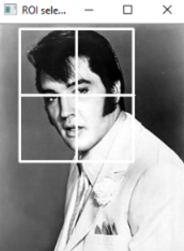
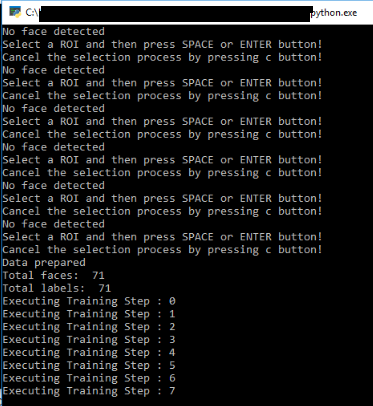

# Face-Reco-openCV
 Simplified Python Code to use OPEN CV in Face Recognition.

## Getting Started
  The approach that is used here is pretty straightforward, there are two parts:

   1. Collect multiple images of the a person's face(eg. Elvis Presely) that you want to recognize.

   2. Train Recognizer on the collected images and see how it detects.

## Prerequisites
   **1. cv2:** This is the Open CV module from Python and will be used here to detect images.
 
   **2. Numpy:** This is used to convert lists into arrays which will be used by open cv.
 
   **3. Os:**  This is for reading the directories where the training files are saved.
    
## Environment SetUp
   
   Install Open CV and Numpy-- 
   ```bash
   pip install matplotlib
   pip install numpy
   pip install opencv-python
   pip install opencv-python==2.4.9
   ```
   for Os -this module is already in python so no need to install it seperately.
   All the above are for Python 2.7x and above.
   
## Run
   
   From Command line run the following:
   
   ```bash
   cd Face-Reco-openCV
   python start trainer.py
   ```
   This trainer trains the model over the required steps thats specified inside.It writes the trainer log within the trainer.yml.
   
   Identify some ROI for some image using the cursor.
   
   
   
   
   next run the face-recognizer inside which we have given the path of the image we want to detect.
   
   python face-recognizer.py
   
   Identify the ROI using the cursor for some image.

There are other files like-- 
   * open-cv files - this is for storing the open-cv files that is been used in training and detection.
   * training-data - this is for storing the images in which will be used for training. 
   * trainer - this is for trainer.yml which is produced during the training.
   * test-data - this is for the storing the images which we are going to test. 
   
## Acknowledgements
  
  * [Face-Detection Using open-cv](https://www.superdatascience.com/opencv-face-recognition/)
  
  * [OpenCv](https://github.com/opencv/opencv)
  
  * [OpenCV with Python for Image and Video Analysis Series](https://www.youtube.com/watch?v=Z78zbnLlPUA&list=PLQVvvaa0QuDdttJXlLtAJxJetJcqmqlQq)
       
